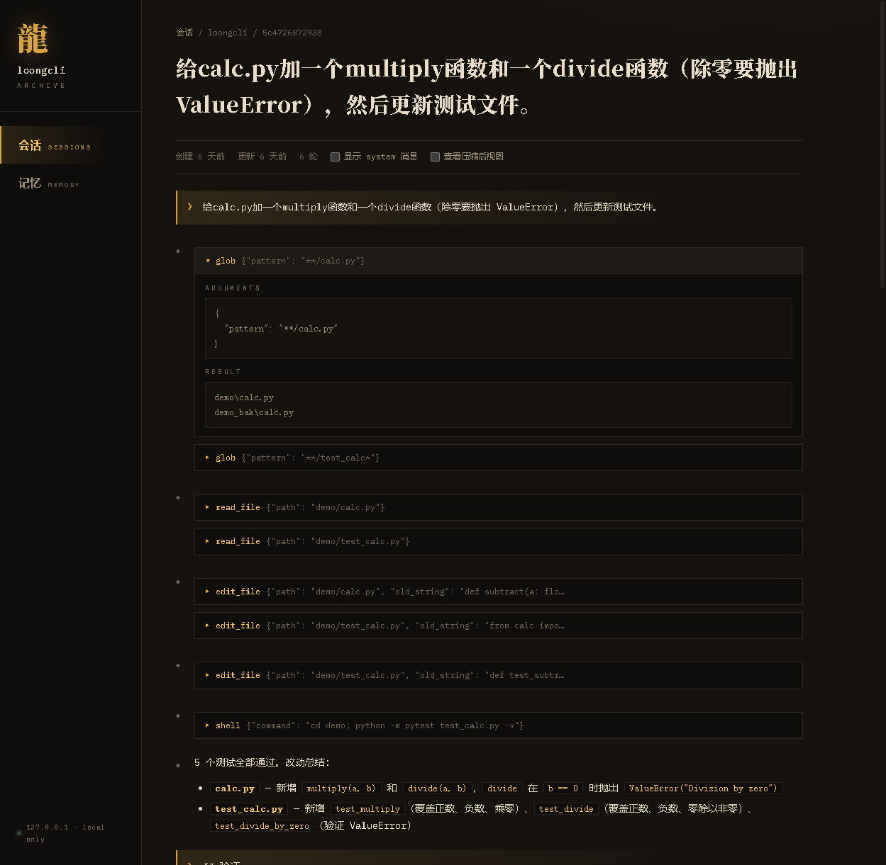

# loongcli

A general-purpose AI Agent CLI built from scratch, inspired by Claude Code's architecture. Independently implemented with streaming agent loop, multi-agent orchestration, LSP code navigation, cache-aware context management, and plan-driven execution.


## Architecture

```
┌──────────────────────────────────────────────────────┐
│                      TUI Layer                       │
│  Rich streaming · Session resume · 18 slash commands │
├──────────────────────────────────────────────────────┤
│                     Agent Loop                       │
│  ReAct cycle · Plan Mode state machine · Verify loop │
├──────────┬───────────┬───────────────────────────────┤
│  Tools   │ Security  │     SubAgent System           │
│ Registry │ 3-layer   │  Delegate · Batch · Coordinator│
│ + Router │ + learning│  Message-passing · Semaphore  │
├──────────┴───────────┴───────────────────────────────┤
│    LSP Navigation    │   MCP Integration             │
│  5 tools · 13 langs  │  Stdio + HTTP transport       │
│  JSON-RPC · AutoDetect│  Tool schema merge           │
├──────────────────────┴───────────────────────────────┤
│                  Context Management                  │
│  Entry truncation · Compactor (archive + summarize)  │
├──────────────────────────────────────────────────────┤
│  Plan/Goal  │  Memory System   │  Skills  │  Hooks   │
│  CRUD+Steps │  Markdown store  │  Registry│  4 events│
│  Approval   │  Recall + Auto   │  AutoLoad│  Intercept│
└─────────────┴──────────────────┴──────────┴──────────┘
```

## Key Systems

### Agent Loop (`loongcli/core/agent.py`)

Streaming ReAct loop with tool calling:

- **Token-by-token streaming** via async generators
- **Plan Mode state machine** — agent voluntarily downgrades to read-only tools, creates structured plan, submits for user approval, then executes with step tracking
- **Verify loop** — after file modifications, auto-runs tests and self-repairs (up to 3 rounds)
- **Loop detection** — identical tool calls repeated 3+ times trigger a warning
- **Per-turn tool call cap** — prevents runaway tool usage

### Tool System (`loongcli/tools/`)

Pluggable tool registry with role-based access control:

- **24 built-in tools**: ReadFile, WriteFile, EditFile, Glob, Grep, Shell, Plan, Memorize, Recall, SearchHistory, Skill, Delegate, BatchDelegate, SendMessage, TaskStatus, WaitTasks, StopTask, EnterPlanMode, ExitPlanMode, and 5 LSP tools (GotoDefinition, FindReferences, SymbolSearch, Hover, Diagnostics)
- **Role-based routing** — 4 roles (Main, Coordinator, SubAgent, Background) with blacklist/whitelist per role
- **Permission learning** — approved tool patterns are remembered for the session

### LSP Semantic Code Navigation (`loongcli/lsp/`)

Language Server Protocol integration for precise code understanding:

- **5 tools**: definition jump, reference search, workspace symbol search, hover type info, diagnostics
- **13 languages**: Python, TypeScript/JS, Go, Rust, C/C++, Java, Ruby, PHP, C#, Lua, Zig
- **Self-implemented JSON-RPC 2.0** client over stdio (no external dependency)
- **Auto-detection** — detects project language from file extensions, lazily starts servers
- **Graceful degradation** — missing server? Returns install suggestion. Unsupported language? Falls back to grep

### SubAgent System (`loongcli/tools/agent_tool.py`)

Multi-agent orchestration with isolation:

- **Single delegation** (`delegate`) and **fan-out/fan-in** (`batch_delegate`)
- **Message passing** — `send_message` / `task_status` for inter-agent communication
- **Coordinator mode** — 4-phase pipeline with concurrency semaphore and depth limits
- **Auto-background** — long-running sub-agents promoted to background tasks
- **`wait_tasks` / `stop_task`** — aggregate results from async tasks, cancel runaway workers

### Plan Mode (`loongcli/core/agent.py`)

State machine for structured planning:

1. **Enter** — Agent calls `enter_plan_mode`, tools downgraded to read-only (read_file, glob, grep, LSP tools)
2. **Research** — Agent explores codebase with restricted tools
3. **Plan** — Creates structured plan via `plan` tool (title + concrete steps)
4. **Approve** — Calls `exit_plan_mode`, user sees plan and approves / rejects / gives feedback
5. **Execute** — Full tools restored, agent follows plan with step-by-step progress tracking

### Context Window Management

Disk-cache-aware, two mechanisms. (A 5-layer compression pyramid was built first, then measured against provider prefix caching and deliberately deleted — rewriting mid-history breaks the cache and costs ~22x more than replaying full history.)

- **Entry truncation** — tool results capped at append time (8K per result, 16K for errors, 30K per turn) with explicit markers so the agent can re-fetch a narrower view; history is never mutated, keeping the prefix cache hot
- **Compactor fuse** — near the window limit: archive originals to session storage, trim if over budget, LLM-summarize; circuit breaker stops after 3 consecutive failures

In practice the fuse rarely fires — 1M-token windows plus entry truncation keep normal sessions far below the threshold.

### Three-Layer Permission System (`loongcli/security/`)

```
Safety Floor (hardcoded) → Rule Engine (configurable) → User Confirm (interactive)
```

- **Session learning** — approved patterns (e.g., write to `src/`) auto-allowed for rest of session
- **Tiered model** — reads auto-pass, writes learn on approval, dangerous operations always confirm
- Common dangerous patterns (rm -rf, format, etc.) blocked at baseline level

### Hook System (`loongcli/hooks/`)

User-programmable interception at 4 lifecycle events — deterministic policy enforced by the harness, not by prompt goodwill:

- **Events**: `PreToolUse` / `PostToolUse` / `SessionStart` / `SessionEnd`
- **Contract**: event context arrives as JSON on stdin; exit code `2` blocks the tool call (PreToolUse) and stdout becomes the reason fed back to the model — visible and recoverable, the agent adjusts course. Other non-zero exit codes log a warning without blocking (a broken hook must not paralyze the agent). Default 30s timeout, then the child process is explicitly killed
- **Matcher**: exact tool names, `a|b` alternation, `*` wildcard
- Runs **before** the permission checker, orthogonal to it — permissions are built-in rule tables, hooks are your arbitrary logic (query external state, call your own scripts)

Configure in `~/.loongcli/config.json`:

```json
{
  "hooks": {
    "PreToolUse": [
      {"matcher": "shell", "command": "python scripts/shell_guard.py", "timeout": 10}
    ],
    "PostToolUse": [
      {"matcher": "edit_file|write_file", "command": "python scripts/audit.py"}
    ],
    "SessionEnd": [
      {"matcher": "*", "command": "python scripts/notify.py"}
    ]
  }
}
```

A minimal PreToolUse guard:

```python
import json, sys

ctx = json.load(sys.stdin)          # {"tool": "shell", "arguments": {...}}
if ".env" in ctx["arguments"].get("command", ""):
    print("blocked by hook: command touches .env")
    sys.exit(2)                      # 2 = block; stdout becomes the reason
```

Typical uses: safety gates (block command patterns / protected paths), audit trails (append every tool call to your own log), automation (run formatter after edits), notifications (SessionEnd). Note the boundary with telemetry: the built-in event stream (`{session}.events.jsonl`) already records llm_call/tool_exec/compact/verify/recall in-process — read it for analysis; hooks are for pushing events into your own systems or intervening. Hooks currently fire for the main agent only (sub-agent tool calls are covered by the permission system, not hooks).

### Memory System (`loongcli/memory/`)

Markdown-based persistent memory with two-scope routing:

- **Two-layer stores** — user-scope facts live in a global store (`~/.loongcli/memory`); project/feedback/reference memories live in per-project stores (`~/.loongcli/projects/<slug>/memory`). A `MemoryRouter` routes writes by type, reads project-first with global fallback
- **Progressive disclosure** — system prompt carries the current project's index + the global index + one-line pointers to other projects' indexes (read on demand; three-segment budget ≤25KB)
- **Per-memory files** with YAML frontmatter (type, name, description); 4 types: user, feedback, project, reference
- **Recall engine** — LLM-powered semantic recall (top-5); skips itself entirely when the injected index already lists every memory
- **Auto-extraction** — fire-and-forget LLM extraction of memorable facts after each turn
- **Dedup + aging** — Jaccard overlap merge, 90-day index hiding for project/reference types

### Web UI (`loongcli/web/`)

Local browser interface for archives — zero new dependencies (stdlib `http.server`):

- **Session browser** — read-only view of full conversation history across all projects, with collapsible tool calls and markdown rendering. Read-only is enforced at the routing layer (only GET handlers exist).
- **Memory manager** — full CRUD over the markdown memory store, with type filtering and dedup-merge feedback
- **Two entry points** — `/web` slash command (daemon thread + auto-open browser) or standalone `loongcli web`
- **Localhost only** — binds 127.0.0.1, path-traversal guarded, tested



### Multi-Provider Support (`loongcli/core/provider.py`)

- **Unified interface** for DeepSeek, OpenAI, Claude, Ollama
- **3-role routing** — main, sub, utility each configurable to different provider/model
- **Token cost tracking** — per-role pricing with built-in rate table, `/usage` command

## Setup

```bash
pip install -e .
loongcli
```

On first run, `~/.loongcli/` and a default `config.json` are created automatically. Set your API key:

```bash
# Option 1: Edit config file
# Open ~/.loongcli/config.json and fill in "api_key"

# Option 2: Environment variable
export DEEPSEEK_API_KEY="sk-..."
```

### Slash Commands

```
/help      — Show all commands          /plan [desc]   — Enter plan mode
/model     — Switch model/profile       /goal <desc>   — Autonomous execution
/compact   — Manual compaction          /think [level] — Toggle thinking mode
/usage     — Token usage & cost         /fast /pro     — Quick model switch
/remember  — Save memory                /forget        — Delete memory
/memories  — List memories              /init          — Create LOONG.md template
/clear     — Clear conversation         /verbose       — Toggle tool output detail
/config    — View/open config           /web           — Open Web UI (sessions + memory)
/rollback  — Restore file snapshots (auto-checkpoint before write/edit)
```

## Testing

```bash
pip install pytest pytest-asyncio
python -m pytest tests/ -q
```

1560+ unit tests covering agent loop, tool execution, LSP integration, plan mode, sub-agents, permissions, compaction, memory (two-layer routing), hooks, telemetry, web API, onboarding, and TUI.

## Project Structure

```
loongcli/
├── core/           # Agent loop, LLM client, compaction, config, events, provider
├── tools/          # Tool registry, 24 built-in tools, role routing
├── lsp/            # LSP client, server manager, 5 navigation tools
├── tui/            # Terminal UI, session management, 18 commands
├── security/       # Permission checker, safety floor, session learning
├── mcp/            # MCP client (stdio + HTTP)
├── memory/         # Markdown store, recall engine, auto-extraction
├── plan/           # Plan store, step tracking
├── skills/         # Skill registry, auto-activation
├── hooks/          # Lifecycle hook system (4 events)
└── web/            # Local Web UI: session browser (read-only) + memory CRUD
tests/              # 1560+ unit tests
```

## License

MIT
