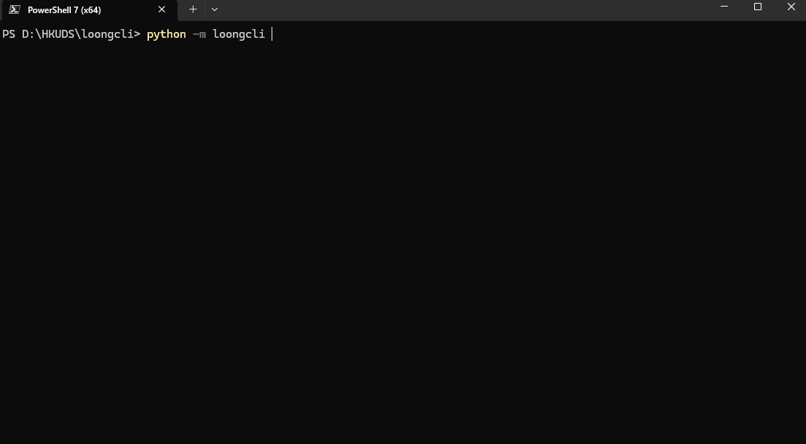

# loongcli

A general-purpose AI Agent CLI built from scratch, inspired by Claude Code's architecture. Independently implemented with streaming agent loop, multi-agent orchestration, LSP code navigation, 5-layer context management, and plan-driven execution.



## Architecture

```
┌──────────────────────────────────────────────────────┐
│                      TUI Layer                       │
│  Rich streaming · Session resume · 14 slash commands │
├──────────────────────────────────────────────────────┤
│                     Agent Loop                       │
│  ReAct cycle · Plan Mode state machine · Verify loop │
├──────────┬───────────┬───────────────────────────────┤
│  Tools   │ Security  │     SubAgent System           │
│ Registry │ 3-layer   │  Delegate · Batch · Coordinator│
│ + Router │ + learning│  Message-passing · Semaphore  │
├──────────┴───────────┴───────────────────────────────┤
│    LSP Navigation    │   MCP Integration             │
│  5 tools · 13 langs  │  Stdio + HTTP transport       │
│  JSON-RPC · AutoDetect│  Tool schema merge           │
├──────────────────────┴───────────────────────────────┤
│           Context Management (5-layer)               │
│  Collapse · Truncate · Compact · Auto-compact · Snip │
├──────────────────────────────────────────────────────┤
│  Plan/Goal  │  Memory System   │  Skills  │  Hooks   │
│  CRUD+Steps │  Markdown store  │  Registry│  4 events│
│  Approval   │  Recall + Auto   │  AutoLoad│  Intercept│
└─────────────┴──────────────────┴──────────┴──────────┘
```

## Key Systems

### Agent Loop (`loongcli/core/agent.py`)

Streaming ReAct loop with tool calling:

- **Token-by-token streaming** via async generators
- **Plan Mode state machine** — agent voluntarily downgrades to read-only tools, creates structured plan, submits for user approval, then executes with step tracking
- **Verify loop** — after file modifications, auto-runs tests and self-repairs (up to 3 rounds)
- **Loop detection** — identical tool calls repeated 3+ times trigger a warning
- **Per-turn tool call cap** — prevents runaway tool usage

### Tool System (`loongcli/tools/`)

Pluggable tool registry with role-based access control:

- **24 built-in tools**: ReadFile, WriteFile, EditFile, Glob, Grep, Shell, Plan, Memorize, Recall, Skill, Delegate, BatchDelegate, SendMessage, TaskStatus, WaitTasks, StopTask, EnterPlanMode, ExitPlanMode, and 5 LSP tools (GotoDefinition, FindReferences, SymbolSearch, Hover, Diagnostics)
- **Role-based routing** — 4 roles (Main, Coordinator, SubAgent, Background) with blacklist/whitelist per role
- **Permission learning** — approved tool patterns are remembered for the session

### LSP Semantic Code Navigation (`loongcli/lsp/`)

Language Server Protocol integration for precise code understanding:

- **5 tools**: definition jump, reference search, workspace symbol search, hover type info, diagnostics
- **13 languages**: Python, TypeScript/JS, Go, Rust, C/C++, Java, Ruby, PHP, C#, Lua, Zig
- **Self-implemented JSON-RPC 2.0** client over stdio (no external dependency)
- **Auto-detection** — detects project language from file extensions, lazily starts servers
- **Graceful degradation** — missing server? Returns install suggestion. Unsupported language? Falls back to grep

### SubAgent System (`loongcli/tools/agent_tool.py`)

Multi-agent orchestration with isolation:

- **Single delegation** (`delegate`) and **fan-out/fan-in** (`batch_delegate`)
- **Message passing** — `send_message` / `task_status` for inter-agent communication
- **Coordinator mode** — 4-phase pipeline with concurrency semaphore and depth limits
- **Auto-background** — long-running sub-agents promoted to background tasks
- **`wait_tasks` / `stop_task`** — aggregate results from async tasks, cancel runaway workers

### Plan Mode (`loongcli/core/agent.py`)

State machine for structured planning:

1. **Enter** — Agent calls `enter_plan_mode`, tools downgraded to read-only (read_file, glob, grep, LSP tools)
2. **Research** — Agent explores codebase with restricted tools
3. **Plan** — Creates structured plan via `plan` tool (title + concrete steps)
4. **Approve** — Calls `exit_plan_mode`, user sees plan and approves / rejects / gives feedback
5. **Execute** — Full tools restored, agent follows plan with step-by-step progress tracking

### Context Window Management

5-layer compression pyramid:

| Layer | Mechanism | Cost |
|-------|-----------|------|
| 1. Context Collapse | Read-time projection (no message mutation) | Zero |
| 2. Tool Result Truncation | Cap per-result (8K) and per-turn (30K) | Zero |
| 3. Compact | LLM summarization with attachment preservation | 1 API call |
| 4. Auto-compact | Threshold-triggered, rebuilds system prompt | Automatic |
| 5. Snip | Delete oldest messages entirely | Zero |

Circuit breaker stops compaction after 3 consecutive failures.

### Three-Layer Permission System (`loongcli/security/`)

```
Safety Floor (hardcoded) → Rule Engine (configurable) → User Confirm (interactive)
```

- **Session learning** — approved patterns (e.g., write to `src/`) auto-allowed for rest of session
- **Tiered model** — reads auto-pass, writes learn on approval, dangerous operations always confirm
- Common dangerous patterns (rm -rf, format, etc.) blocked at baseline level

### Memory System (`loongcli/memory/`)

Markdown-based persistent memory:

- **Per-memory files** with YAML frontmatter (type, name, description)
- **4 types**: user, feedback, project, reference
- **MEMORY.md index** auto-injected into system prompt (200 lines / 25KB cap)
- **Recall engine** — LLM-powered semantic recall (top-5 relevant memories per query)
- **Auto-extraction** — fire-and-forget LLM extraction of memorable facts after each turn
- **Dedup + aging** — Jaccard overlap merge, 90-day hiding for project/reference types

### Multi-Provider Support (`loongcli/core/provider.py`)

- **Unified interface** for DeepSeek, OpenAI, Claude, Ollama
- **3-role routing** — main, sub, utility each configurable to different provider/model
- **Token cost tracking** — per-role pricing with built-in rate table, `/usage` command

## Setup

```bash
pip install -e .
loongcli
```

On first run, `~/.loongcli/` and a default `config.json` are created automatically. Set your API key:

```bash
# Option 1: Edit config file
# Open ~/.loongcli/config.json and fill in "api_key"

# Option 2: Environment variable
export DEEPSEEK_API_KEY="sk-..."
```

### Slash Commands

```
/help      — Show all commands          /plan [desc]  — Enter plan mode
/model     — Switch model/profile       /goal <desc>  — Autonomous execution
/compact   — Manual compaction          /think [level] — Toggle thinking mode
/usage     — Token usage & cost         /fast /pro     — Quick model switch
/remember  — Save memory               /init          — Generate LOONG.md
```

## Testing

```bash
pip install pytest pytest-asyncio
python -m pytest tests/ -q
```

1002 unit tests covering agent loop, tool execution, LSP integration, plan mode, sub-agents, permissions, compaction, memory, onboarding, and TUI.

## Project Structure

```
loongcli/
├── core/           # Agent loop, LLM client, compaction, config, events, provider
├── tools/          # Tool registry, 24 built-in tools, role routing
├── lsp/            # LSP client, server manager, 5 navigation tools
├── tui/            # Terminal UI, session management, 14 commands
├── security/       # Permission checker, safety floor, session learning
├── mcp/            # MCP client (stdio + HTTP)
├── memory/         # Markdown store, recall engine, auto-extraction
├── plan/           # Plan store, step tracking
├── skills/         # Skill registry, auto-activation
└── hooks/          # Lifecycle hook system (4 events)
tests/              # 1002 unit tests
```

## License

MIT
